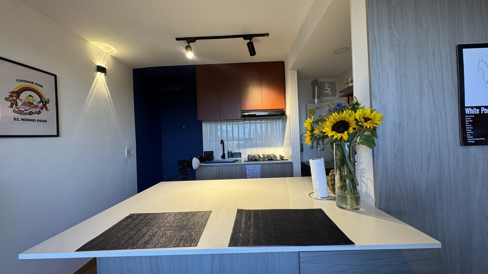

# DOKO Studio — Landing Page de Remodelaciones

Plan de acción y guía del proyecto. **Leer este archivo completo antes de tocar el código.**

---

## 1. Resumen del proyecto

- **Cliente/Marca:** DÔKO Studio
- **Negocio:** Remodelación de casas — terminación de casas en **obra gris** y remodelación integral de **casas usadas**.
- **Objetivo de la página:** Generar contactos (cotizaciones) vía WhatsApp y formulario. Transmitir elegancia, profesionalismo y confianza.
- **Idioma:** Español.

## 2. Dirección de diseño (DECIDIDA — no cambiar sin aprobación del cliente)

Se evaluaron 4 opciones de estética y el cliente eligió el **lujo oscuro**. Ese diseño fue luego **ajustado para ser 100% fiel al manual de marca oficial** que el cliente aportó en `diseño Doko/` (`Referentes visuales - moodboard.pdf` = brand guidelines 2026; `Copia de Plantilla Cotización DOKO STUDIO.pdf` = aplicación real de la marca en un documento). Ese manual es la **fuente de verdad** para cualquier decisión de color, tipografía o tono — ante cualquier duda de diseño, consultarlo antes de improvisar.

- **Negro protagonista** ("Negro ratón") en hero, sección de diferenciales, contacto y footer, alternando con crema y blanco.
- Titulares en **sans-serif bold (Poppins, sustituto de Mont)**; la frase/palabra de énfasis en **serif itálica (Cardo)** color naranja — el patrón tipográfico exacto del manual de marca.
- Header **claro** con el **logo a color**.
- Detalles editoriales: eyebrows con cuadrito naranja, retícula con bordes finos en diferenciales, banda CTA naranja, datos de contacto en filas.
- **Barra de estadísticas flotante** que cabalga entre el hero negro y la sección clara.
- **Arco circular fino** detrás del texto del hero (`.hero-text::before`) — motivo decorativo tomado literalmente de las portadas del manual de marca.
- Tagline oficial **"Precisión, estética, confianza."** en el footer, en Cardo itálica color café.
- La primera palabra del título del hero va en azul petróleo con `<span class="destacado">` — **decisión del cliente: solo en el hero**, no replicar en otros títulos.
- Animaciones sobrias: aparición al scroll con entrada escalonada, hovers con elevación/zoom leve, brillos radiales estáticos en hero y banda CTA.

### Paleta oficial (variables en `css/styles.css` — usar SIEMPRE las variables, nunca hex sueltos)

Hex exactos tomados del manual de marca (`diseño Doko/Referentes visuales - moodboard.pdf`, página "Paleta de color"):

| Variable CSS      | Hex       | Nombre oficial   | Uso                                                        |
|-------------------|-----------|------------------|-------------------------------------------------------------|
| `--negro`         | `#191919` | Negro ratón      | Fondos oscuros protagonistas (hero, diferenciales, contacto, footer) |
| `--negro-suave`   | `#1A3E46` | Celeste oscuro   | Tarjetas y barras sobre fondo negro                         |
| `--azul`          | `#0E5B6D` | Azul petróleo    | Acento secundario: eyebrows, números de proceso, etiquetas  |
| `--azul-claro`    | `#3D93A6` | (tinte derivado) | Versión clara del azul petróleo, legible sobre fondos oscuros (palabra destacada del hero) |
| `--naranja`       | `#EB5B34` | Naranja          | Acento principal: botones, CTA, cursivas, cifras             |
| `--cafe`          | `#A95D39` | Café claro       | Acento terciario, uso puntual (tagline del footer)           |
| `--crema`         | `#FFF5F0` | Crema            | Secciones claras alternas                                    |
| `--tinta`         | `#191919` | Negro ratón      | Texto sobre fondos claros                                    |

Colores del manual **no usados aún** en la web (disponibles si se necesitan): `Azul claro #E1F8FD` (para fondos muy pálidos o tags).

### Tipografía oficial

- **Mont** (fuente principal de marca) → sustituida por **Poppins** (Google Fonts) por no estar disponible gratuitamente. Se usa en `--font-display` y `--font-body`, peso 700 en titulares.
- **Cardo** (fuente secundaria oficial, sí disponible en Google Fonts) → `--font-accent`, itálica, para toda frase o palabra de énfasis (equivalente exacto al uso del manual de marca).
- Regla: cualquier texto en cursiva debe usar `var(--font-accent)`, nunca `font-style: italic` sobre Poppins (no se cargan sus cortes itálicos).

### Branding

Copias listas para usar en `assets/`: `logo.png` (color, para el header claro), `logo-blanco.png` (para footer y fondos oscuros), `icono.png` (favicon). El manual de marca y la plantilla de cotización oficial están en `diseño Doko/` — **no versionada** (excluida en `.gitignore` para mantener el repo liviano, ~8.5MB de PDFs), pero es la referencia de diseño más importante del proyecto: no borrarla del disco. Las referencias visuales antiguas y el branding original en bruto están en `_archivo/` (también excluida, no borrar).

## 3. Stack técnico (decidido — no cambiar sin razón)

- **HTML + CSS + JavaScript puros. Sin frameworks, sin build tools, sin npm.**
- Se abre directamente con doble clic en `index.html` o con cualquier servidor estático.
- Un solo archivo por tipo: `index.html`, `css/styles.css`, `js/main.js`.
- JS mínimo: menú móvil, scroll-reveal con `IntersectionObserver`, año dinámico del footer, filtro de galería por zona.

## 4. Estructura de la página (ya construida)

| # | Sección (id)        | Contenido |
|---|---------------------|-----------|
| 1 | Header sticky claro | Logo a color, navegación, botón CTA "Cotizar ahora" |
| 2 | `#inicio` (Hero)    | Negro con brillos, titular Poppins+Cardo, 2 CTAs, **foto real** (sala del proyecto Centriktown), barra de estadísticas flotante |
| 3 | `#servicios`        | Crema. 3 tarjetas con **fotos reales**: Obra gris, Casas usadas, Acabados y diseño |
| 4 | `#por-que`          | Negro. Retícula 2×2 de diferenciales con bordes finos |
| 5 | `#proceso`          | Blanco. 4 pasos en tarjetas crema con círculos verdes |
| 6 | Banda CTA           | Naranja, con botón negro a WhatsApp |
| 7 | `#proyectos`        | Crema. **Cinta infinita** (marquee) con las fotos reales del proyecto, luego chips de filtro por zona + galería (grid en escritorio, **carrusel deslizable en móvil**). Cada tarjeta abre un **lightbox** con su propio carrusel animado (contador, zoom Ken Burns) |
| 8 | `#testimonios`      | Blanco. 3 tarjetas con citas en serif itálica |
| 9 | `#contacto`         | Negro. Datos en filas + formulario en tarjeta blanca |
| 10| Footer              | Negro. Logo blanco, navegación, redes |

## 5. Datos pendientes del cliente (placeholders en el código)

- [x] **WhatsApp y correo reales** — ya aplicados (`+57 305 798 9724` / `camiloromeroe@gmail.com`), tomados del bloque "CONTACTO" de `diseño Doko/Copia de Plantilla Cotización DOKO STUDIO.pdf`. Si ese contacto debe ser distinto en la web pública (p. ej. una línea comercial dedicada en vez de un correo personal), avisar para actualizarlo — buscar `573057989724` y `camiloromeroe@gmail.com` en `index.html`.
- [ ] **Cobertura real** (ciudad/zona) — sigue como placeholder genérico "Ciudad y alrededores".
- [x] **Fotos reales de Sala, Cocina, Baño y Habitación** — ya aplicadas (ver §6b), tomadas de un proyecto real terminado (apartamento VIS "Centriktown"). Pendiente: **Fachada** y **Antes/Después** siguen en placeholder de texto — ese proyecto no incluía fotos de fachada ni tomas de "antes" (carpeta `Terminados/`, solo fotos "después"). Si llegan fotos de otro proyecto con fachada o con registro de antes/después, agregarlas siguiendo el mismo patrón.
- [x] **Fotos reales en hero y tarjetas de servicio** — ya aplicadas, reutilizando las mismas 11 fotos del proyecto Centriktown (ver §6c). Cuando haya fotos de más proyectos, lo ideal es variar estas portadas para no repetir siempre el mismo apartamento.
- [ ] **Testimonios reales** (nombre + texto). Los actuales son de muestra.
- [ ] **Redes sociales** en el footer (los enlaces apuntan a `#`).
- [ ] **Destino del formulario**: hoy no envía a ningún lado (solo muestra confirmación). Opciones: Formspree, correo, o redirigir a WhatsApp con el texto prellenado.
- [ ] **Años de trayectoria exactos**: el manual de marca dice "más de cinco años"/"más de [X] años" — confirmar la cifra exacta si se quiere citar en la web.

## 6. Cómo reemplazar/agregar fotos reales de proyectos

Cada tarjeta de `.gallery` es un `<button>` con tres piezas: la **portada** (`` visible en la cuadrícula), la **insignia** de conteo (`<span class="ph-badge">`), y el atributo **`data-fotos`** con todas las tomas de esa zona (usadas por el lightbox, ver §6b).

**Zona con fotos reales** (patrón usado en Sala/Cocina/Baño/Habitación):
```html
<button type="button" class="ph-tile reveal" data-zona="cocina" data-titulo="Cocina — Nombre del proyecto" data-fotos="assets/proyectos/cocina-1.jpg|assets/proyectos/cocina-2.jpg|assets/proyectos/cocina-3.jpg">
  
  <span class="ph-badge">3 fotos</span>
</button>
```

**Zona sin fotos todavía** (patrón usado en Fachada/Antes-Después — placeholder de texto):
```html
<button type="button" class="ph ph-tile reveal" data-zona="fachada" data-titulo="Fachada" data-fotos="Fachada renovada|Detalle de acabados exteriores">FOTO: fachada renovada<span class="ph-badge">2 fotos</span></button>
```
La diferencia clave: la variante con fotos reales **no lleva la clase `.ph`** (esa clase pinta el degradado + texto de placeholder) y en cambio contiene un `` real.

**Para agregar/reemplazar fotos de un proyecto:**
1. Optimizar las imágenes: máx. 1400px de ancho, JPG ≤ 300 KB, y **corregir la orientación EXIF** antes de subirlas (las fotos de celular vienen rotadas por metadata). Script usado en este proyecto — `PIL.ImageOps.exif_transpose()` antes de redimensionar y comprimir; ver ejemplo en el historial de commits o pedir que se regenere.
2. Guardarlas en `assets/proyectos/` con el patrón `zona-N.jpg` (p. ej. `cocina-1.jpg`, `cocina-2.jpg`).
3. Actualizar `data-fotos` de la tarjeta con las rutas separadas por `|` (la primera es la portada, y también debe coincidir con el `src` del `` visible).
4. Actualizar el número en `.ph-badge` para que coincida con la cantidad real de fotos.
5. Actualizar `data-titulo` si quieres que el lightbox muestre el nombre del proyecto/cliente.

**Origen de las fotos actuales:** apartamento VIS "Centriktown" (proyecto real terminado), fotos originales sin procesar archivadas en `_archivo/fotos-centriktown/` (no versionado, se queda solo en este disco). Los zips de Google Drive originales (~8.8 GB, incluyen video) están en `Terminados/`, también fuera del repositorio (`.gitignore`) — no borrar ninguna de las dos carpetas sin respaldo.

## 6b. Galería filtrable por zona, carrusel móvil y lightbox

La sección `#proyectos` combina tres piezas, todas en `js/main.js`:

**Filtro por zona (bloque "5. Filtro de galería"):** los chips (`Todos`, `Sala`, `Cocina`, `Baño`, `Habitación`, `Fachada`, `Antes/Después`) muestran u ocultan las tarjetas de `.gallery` según su atributo `data-zona`.
- **Escritorio/tablet (>720px):** `.gallery` es una cuadrícula normal; los chips ocultan/muestran tarjetas dentro de ella.
- **Móvil (≤720px):** `.gallery` se convierte automáticamente en un **carrusel horizontal deslizable** (CSS `scroll-snap`); los chips filtran qué tarjetas entran en ese carrusel.

**Para agregar una nueva zona** (p. ej. "Terraza"): agregar un botón `<button class="filter-chip" data-filter="terraza">Terraza</button>` en `.gallery-filters`, y usar `data-zona="terraza"` en la tarjeta correspondiente. No se necesita tocar el JS — el filtro es genérico.

**Lightbox (bloque "6. Lightbox"):** al hacer clic en cualquier tarjeta se abre un carrusel modal animado con las fotos listadas en `data-fotos` de esa tarjeta:
- Transición fade + slide con `cubic-bezier`, flechas, puntos, swipe táctil, navegación por teclado ←/→/Esc, foco accesible.
- **Contador "N / total"** (`#lightboxContador`) bajo el título, actualizado en cada cambio de slide.
- **Zoom Ken Burns**: la foto activa recibe la clase `.is-active` y se anima con un `scale(1 → 1.06)` muy lento (`transition: transform 6s`) mientras está visible — efecto editorial sutil, se desactiva con `prefers-reduced-motion`.
- El JS detecta automáticamente si cada entrada de `data-fotos` es una **ruta de imagen** (termina en `.jpg/.png/.webp` → foto real) o **texto** (placeholder `.ph`) — por eso zonas con fotos reales y zonas sin fotos conviven sin conflicto usando el mismo mecanismo.

## 6c. Cinta infinita (marquee) y fotos reales en hero/servicios

Justo antes de los chips de filtro, `#proyectos` tiene una **cinta infinita** (`.marquee`) que hace scroll automático y continuo. Es puramente decorativa (`aria-hidden="true"`) — la experiencia accesible/interactiva sigue siendo la cuadrícula filtrable + lightbox de abajo.

**Sincronizada con el filtro de zona:** la cinta no es estática — reacciona al chip seleccionado. El HTML solo trae el contenedor vacío (`<div class="marquee-track" id="marqueeTrack">`); todo el contenido lo arma `js/main.js` con la función `actualizarMarquee(zona)` (dentro del bloque "5. Filtro de galería"), a partir del array `fotosProyecto` (zona + ruta de cada foto):
- `"todos"` → cinta con las 11 fotos.
- Una zona específica (p. ej. `"cocina"`) → cinta con **solo** las fotos de esa zona, duplicadas para el loop sin costura, y con la duración de la animación recalculada (`fotos.length * 3.5s`, mínimo 10s) para que el ritmo se sienta parejo aunque haya pocas fotos.
- Zona sin fotos reales (Fachada, Antes/Después) → la cinta completa se oculta (`.marquee.is-hidden`) en vez de mostrarse vacía.

Se pausa al pasar el mouse (`:hover { animation-play-state: paused }`) y se congela con `prefers-reduced-motion`. Los bordes tienen un degradado de máscara (`mask-image`) para que las fotos aparezcan/desaparezcan suavemente en los extremos.

**Para agregar fotos nuevas a la cinta**: agregar la entrada `{ zona: "...", src: "..." }` al array `fotosProyecto` en `js/main.js` — no hace falta tocar el HTML ni duplicar nada a mano, la función arma el loop automáticamente.

Las mismas 11 fotos también se reutilizan como portada del **hero** (`sala-1.jpg`) y de las **3 tarjetas de servicios** (`habitacion-1.jpg`, `cocina-2.jpg`, `bano-1.jpg`), reemplazando los placeholders `.ph`. El patrón para reemplazarlas es el mismo que en §6: quitar la clase `.ph` del contenedor y usar un `` real; el CSS ya trae las reglas `img.ph-hero` y `.card img.ph-card` para que la foto llene el marco con `object-fit: cover`.

## 7. Roadmap por fases

### Fase 1 — Base (✅ HECHA)
Estructura completa, sistema de diseño de lujo oscuro elegido entre 4 opciones, responsive, animaciones básicas, repositorio Git inicializado.

### Fase 1b — Fidelidad de marca (✅ HECHA)
Ajuste de paleta, tipografía (Poppins+Cardo) y motivos decorativos para que el diseño sea 100% fiel al manual de marca oficial aportado por el cliente. Contacto real (WhatsApp/correo) aplicado. Ver §2 para el detalle completo.

### Fase 2 — Contenido real (siguiente)
1. Reemplazar todos los `TODO:` del §5.
2. Insertar fotos reales (§6).
3. Ajustar textos con la voz del cliente (precios, cobertura, años de experiencia).

### Fase 3 — Funcionalidad
1. Conectar el formulario (Formspree o wa.me prellenado — lo más simple).
2. Botón flotante de WhatsApp (opcional).
3. SEO: revisar `<title>`, meta description, Open Graph con foto real.
4. Publicar con GitHub Pages (Settings → Pages → rama `main`, carpeta raíz).

### Fase 4 — Pulido (solo si se pide)
1. Lightbox en la galería de proyectos.
2. Slider de antes/después de remodelaciones (gran argumento de venta).
3. Micro-animaciones adicionales, contador de proyectos.

## 8. Reglas para quien continúe (humano o IA)

1. **No introducir frameworks ni dependencias.** Todo debe seguir abriéndose con doble clic.
2. **Usar las variables CSS existentes** para cualquier color o espaciado nuevo.
3. Mantener el contenido **en español** y el tono profesional-cercano.
4. Cada sección nueva debe llevar la clase `reveal` para heredar la animación de entrada.
5. El destacado verde (`.destacado`) es exclusivo del título del hero.
6. Probar en móvil (≤ 480px), tablet y escritorio antes de dar por terminado un cambio.
7. La carpeta `_archivo/` (referencias y branding original) no se versiona; no borrarla del disco.
