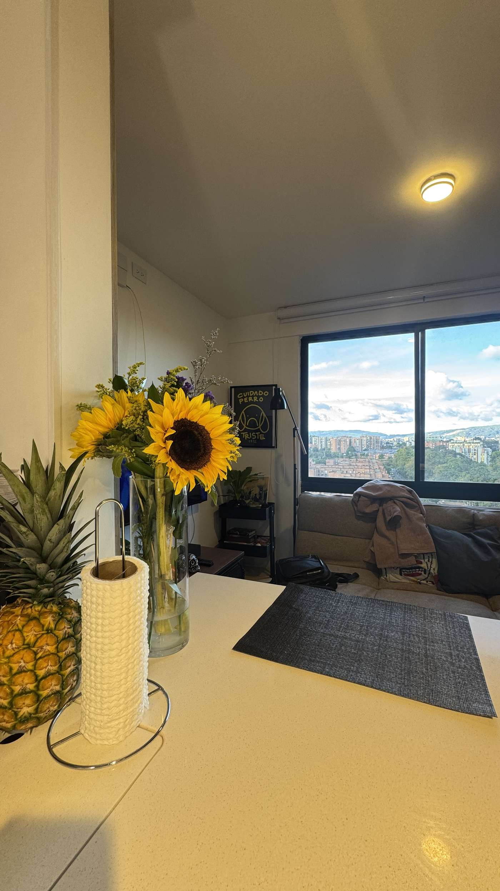

# DOKO Studio — Landing Page de Remodelaciones

Plan de acción y guía del proyecto. **Leer este archivo completo antes de tocar el código.**

---

## 1. Resumen del proyecto

- **Cliente/Marca:** DÔKO Studio
- **Negocio:** Remodelación de casas — terminación de casas en **obra gris** y remodelación integral de **casas usadas**.
- **Objetivo de la página:** Generar contactos (cotizaciones) vía WhatsApp y formulario. Transmitir elegancia, profesionalismo y confianza.
- **Idioma:** Español.

## 2. Dirección de diseño (DECIDIDA — no cambiar sin aprobación del cliente)

Se evaluaron 4 opciones y el cliente eligió la estética de **lujo oscuro** (inspirada en referencias tipo ARCOVA, archivadas en `_archivo/`):

- **Negro protagonista** en hero, sección de diferenciales, contacto y footer, alternando con crema y blanco.
- Titulares **serif (Fraunces)** con la frase clave en *cursiva naranja*; cuerpo en **Manrope**.
- Header **claro** con el **logo a color**.
- Detalles editoriales: eyebrows con cuadrito naranja, retícula con bordes finos en diferenciales, banda CTA naranja, datos de contacto en filas.
- **Barra de estadísticas flotante** que cabalga entre el hero negro y la sección clara.
- La primera palabra del título del hero va en verde con `<span class="destacado">` — **decisión del cliente: solo en el hero**, no replicar en otros títulos.
- Animaciones sobrias: aparición al scroll con entrada escalonada, hovers con elevación/zoom leve, brillos radiales estáticos en hero y banda CTA.

### Paleta oficial (variables en `css/styles.css` — usar SIEMPRE las variables)

| Variable CSS      | Hex       | Uso                                                        |
|-------------------|-----------|-------------------------------------------------------------|
| `--negro`         | `#131518` | Fondos oscuros protagonistas (hero, diferenciales, contacto, footer) |
| `--negro-suave`   | `#1C1F24` | Tarjetas y barras sobre fondo negro                         |
| `--naranja`       | `#EB5B34` | Acento principal: botones, CTA, cursivas, cifras            |
| `--azul`          | `#105A6B` | Verde azulado del logo, acento secundario sutil (eyebrows, números de proceso, etiquetas) |
| `--azul-claro`    | `#2E8FA6` | Versión clara del verde para fondos oscuros (palabra destacada del hero) |
| `--crema`         | `#F7F4EF` | Secciones claras alternas                                   |
| `--tinta`         | `#191B1E` | Texto sobre fondos claros                                   |

### Branding

Copias listas para usar en `assets/`: `logo.png` (color, para el header claro), `logo-blanco.png` (para footer y fondos oscuros), `icono.png` (favicon). Los originales y las referencias de diseño están en `_archivo/` (excluida del repositorio).

## 3. Stack técnico (decidido — no cambiar sin razón)

- **HTML + CSS + JavaScript puros. Sin frameworks, sin build tools, sin npm.**
- Se abre directamente con doble clic en `index.html` o con cualquier servidor estático.
- Un solo archivo por tipo: `index.html`, `css/styles.css`, `js/main.js`.
- JS mínimo: menú móvil, scroll-reveal con `IntersectionObserver`, año dinámico del footer.

## 4. Estructura de la página (ya construida)

| # | Sección (id)        | Contenido |
|---|---------------------|-----------|
| 1 | Header sticky claro | Logo a color, navegación, botón CTA "Cotizar ahora" |
| 2 | `#inicio` (Hero)    | Negro con brillos, titular serif, 2 CTAs, foto, barra de estadísticas flotante |
| 3 | `#servicios`        | Crema. 3 tarjetas: Obra gris, Casas usadas, Acabados y diseño |
| 4 | `#por-que`          | Negro. Retícula 2×2 de diferenciales con bordes finos |
| 5 | `#proceso`          | Blanco. 4 pasos en tarjetas crema con círculos verdes |
| 6 | Banda CTA           | Naranja, con botón negro a WhatsApp |
| 7 | `#proyectos`        | Crema. Galería 2×3 con placeholders de fotos |
| 8 | `#testimonios`      | Blanco. 3 tarjetas con citas en serif itálica |
| 9 | `#contacto`         | Negro. Datos en filas + formulario en tarjeta blanca |
| 10| Footer              | Negro. Logo blanco, navegación, redes |

## 5. Datos pendientes del cliente (placeholders en el código)

Buscar `TODO:` en `index.html` para localizarlos rápido:

- [ ] **Número de WhatsApp real** — ahora es `573000000000` en los enlaces `wa.me`.
- [ ] **Correo y ciudad/cobertura** en la sección contacto y footer.
- [ ] **Fotos reales de proyectos** — los placeholders son `<div class="ph">`; reemplazar por `` (ver §6).
- [ ] **Testimonios reales** (nombre + texto). Los actuales son de muestra.
- [ ] **Redes sociales** en el footer (los enlaces apuntan a `#`).
- [ ] **Destino del formulario**: hoy no envía a ningún lado (solo muestra confirmación). Opciones: Formspree, correo, o redirigir a WhatsApp con el texto prellenado.

## 6. Cómo reemplazar los placeholders de fotos

Cada foto pendiente es un `<div class="ph">FOTO: descripción</div>`. Para reemplazar:

```html
<!-- Antes -->
<div class="ph ph-tile reveal">FOTO: sala remodelada</div>
<!-- Después -->

```

La clase `.ph` ya trae el radio de esquina y `object-fit: cover`; solo cambiar la etiqueta y agregar `src` + `alt`. Guardar fotos en `assets/proyectos/` (crear la carpeta), idealmente JPG ≤ 300 KB, mínimo 1200px de ancho. Para el estilo oscuro de esta página lucen mejor fotos con buena iluminación cálida.

## 7. Roadmap por fases

### Fase 1 — Base (✅ HECHA)
Estructura completa, sistema de diseño de lujo oscuro elegido entre 4 opciones, responsive, animaciones básicas, repositorio Git inicializado.

### Fase 2 — Contenido real (siguiente)
1. Reemplazar todos los `TODO:` del §5.
2. Insertar fotos reales (§6).
3. Ajustar textos con la voz del cliente (precios, cobertura, años de experiencia).

### Fase 3 — Funcionalidad
1. Conectar el formulario (Formspree o wa.me prellenado — lo más simple).
2. Botón flotante de WhatsApp (opcional).
3. SEO: revisar `<title>`, meta description, Open Graph con foto real.
4. Publicar con GitHub Pages (Settings → Pages → rama `main`, carpeta raíz).

### Fase 4 — Pulido (solo si se pide)
1. Lightbox en la galería de proyectos.
2. Slider de antes/después de remodelaciones (gran argumento de venta).
3. Micro-animaciones adicionales, contador de proyectos.

## 8. Reglas para quien continúe (humano o IA)

1. **No introducir frameworks ni dependencias.** Todo debe seguir abriéndose con doble clic.
2. **Usar las variables CSS existentes** para cualquier color o espaciado nuevo.
3. Mantener el contenido **en español** y el tono profesional-cercano.
4. Cada sección nueva debe llevar la clase `reveal` para heredar la animación de entrada.
5. El destacado verde (`.destacado`) es exclusivo del título del hero.
6. Probar en móvil (≤ 480px), tablet y escritorio antes de dar por terminado un cambio.
7. La carpeta `_archivo/` (referencias y branding original) no se versiona; no borrarla del disco.
